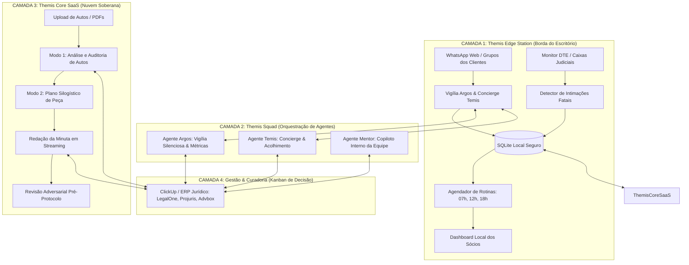

# THEMIS JURÍDICO OS
## O Sistema Operacional de Inteligência Artificial Especializada e Vigília de SLA para Escritórios de Advocacia

> **Ecossistema Live · Documento de Concepção e Arquitetura de Produto para Venda em Massa**  
> **Status:** Pronto para Escala Comercial · **Versão:** 2.0  
> **Data:** Setembro/2026

---

## 1. Visão Geral e Tese de Mercado

O mercado jurídico brasileiro conta com mais de 1,4 milhão de advogados e aproximadamente 80 mil sociedades de advogados ativas. Quase a totalidade dessas bancas enfrenta hoje quatro dores crônicas que ferramentas genéricas de IA (como ChatGPT, Copilot ou bots de WhatsApp comuns) não conseguem resolver:

1. **O Caos do WhatsApp e Perda de Demandas:** Clientes pulverizados em dezenas ou centenas de grupos de WhatsApp. Sócios respondem mensagens de madrugada gerando falsa sensação de atendimento; pedidos urgentes ficam perdidos no meio de conversas sociais; e o escritório não tem controle real de SLA.
2. **Pânico de Alucinação e Risco Ético (OAB):** IAs comerciais comuns inventam julgados, inventam fatos e citam artigos de leis revogados. O advogado não confia e gasta mais tempo revisando do que elaborando.
3. **Risco Crítico de Perda de Prazos em DTEs e Intimações:** Intimações eletrônicas e notificações fiscais (DTE, Domicílio Judicial Eletrônico, DJEN) são recebidas ou compartilhadas por clientes em grupos sem triagem técnica, gerando risco iminente de preclusão e prejuízo milionário.
4. **Vazamento de Segredo de Justiça e LGPD:** Advogados colando petições inteiras com dados de clientes e segredo de justiça em IAs públicas na nuvem, violando deveres fiduciários da OAB e a LGPD.

### A Tese da Themis Jurídico OS
A **Themis Jurídico OS** é a primeira plataforma jurídica de **Inteligência Híbrida (Edge + Cloud + Agentes Autônomos)** concebida especificamente para bancas de advocacia. Ela une a **vigília silenciosa de grupos e SLA** com um **motor de peticionamento e análise processual anti-alucinação**, operando em um ambiente isolado onde o dado sensível nunca sai do controle do escritório.

---

## 2. A Arquitetura em Três Camadas do Produto

---

## 3. Os Quatro Módulos Integrados da Suíte

### Módulo 1: Argos — Vigília Silenciosa de WhatsApp & SLA Operacional
- **Mudança de Unidade (Mensagem vs. Demanda):** Enquanto bots comuns contam "mensagens não lidas", o Argos extrai e qualifica a **DEMANDA**. Uma resposta como *"vou ver isso"* não encerra o chamado; o relógio de SLA continua correndo até a resolução substantiva.
- **Triagem de Legitimidade:** Cruza o número do remetente com a base de clientes. Se o gerente da filial pede informações sobre a ação de divórcio do sócio, a demanda é isolada, acolhida com discrição e bloqueada para o grupo, notificando imediatamente a coordenação.
- **Régua de Urgência N0 a N5 com Aceleradores:** Classificação semântica em tempo real (N0 ruído, N1 dúvida simples, N2 demanda padrão, N3 risco financeiro, N4 bloqueio judicial / penhora, N5 liminar em risco).
- **Régua NX — Protocolo Imediato de DTE:** Detecção em segundos de intimações em Domicílio Tributário Eletrônico ou caixas judiciais. Dispara alerta vermelho para os sócios e só encerra sob **dupla chave** (ciência do advogado responsável + número de protocolo da controladoria).

### Módulo 2: Temis — Concierge de Atendimento Digital & Acolhimento Seguro
- **Acolhimento < 2 Horas:** Responde ao cliente com linguagem sóbria, cordial e humanizada, confirmando recebimento e eliminando a ansiedade que faz o cliente ligar insistentemente para os sócios.
- **Fila Única de Envio com Envelope Anti-Bloqueio:** Nenhuma mensagem é disparada em massa. Há delays estocásticos inteligentes (30s a 90s), simulação de digitação e preservação integral do número corporativo do escritório.
- **Respeito às Faces do Escritório:** Atua apenas dentro da janela de funcionamento do escritório e encaminha as respostas elaboradas pela equipe jurídica sob aprovação prévia.

### Módulo 3: Themis Core SaaS — Motor Jurídico Anti-Alucinação & Peticionamento
- **Modo 1 (Análise Processual Profunda):**
  - Leitura nativa de autos em PDF (200, 500 ou 1.000+ páginas).
  - Triagem de admissibilidade e pressupostos processuais.
  - **Prazos em Código:** A contagem de dias úteis, tempestividade e feriados é calculada rigorosamente por algoritmos determinísticos em código JavaScript/Python, nunca delegada a alucinações de LLM.
  - **Ancoragem Folha a Folha:** Todo fato alegado aponta obrigatoriamente para a folha e a prova documental do processo originário.
- **Modo 2 (Elaboração de Peças com Plano Silogístico):**
  - **Fase 1 (Plano):** O sistema primeiro gera o silogismo jurídico (Fato -> Norma -> Subsunção -> Pedido), hierarquia de teses e cobertura de elementos, submetendo para validação do advogado.
  - **Fase 2 (Redação):** Redação da minuta em streaming, incorporando o pacote de estilo e tom de voz próprio da banca.
  - **Marcador Estrito de Falhas:** O que não estiver demonstrado nos autos não é inventado; o sistema insere expressamente `[DADO FALTANTE: ...]` ou `[VERIFICAR NA FONTE]`.
- **Modo 3 (Revisão Adversarial):**
  - A peça pronta é submetida a uma auditoria que simula o olhar do juiz ou da parte contrária antes de qualquer protocolo, gerando um checklist formal com apontamento de vulnerabilidades, teses contraditórias e veredito de aptidão técnica.

### Módulo 4: Mentor Jurídico Interno — Copiloto da Equipe & Controladoria
- **Onboarding de Estagiários e Advogados Juniores:** Explica passo a passo teses do escritório, modelos de cálculo e rotinas internas.
- **Tradução de Andamentos Processuais:** Converte despachos herméticos em notas claras para o cliente ou para a equipe de atendimento.
- **Três Rotinas Diárias Automatizadas (07h, 12h e 18h):**
  - *07h00:* Briefing Matinal dos Sócios com mensagens da madrugada, prazos fatais e alertas vermelhos.
  - *12h00:* Auditoria de SLA do meio-dia (demandas que vão estourar à tarde).
  - *18h00:* Fechamento Diário com balanço de petições minutadas, revisadas e produtividade da banca.

---

## 4. Diferenciais Competitivos Imbatíveis

| Critério | IAs Genéricas (ChatGPT, Copilot) | Legaltechs Tradicionais (SaaS Comum) | **Themis Jurídico OS** |
|---|---|---|---|
| **Controle de WhatsApp** | Inexistente ou bot robótico chato | Apenas centralizador de chat (tipo Helpdesk) | **Vigília semântica em centenas de grupos simultâneos com SLA de demanda** |
| **Precisão de Prazos** | Alucina prazos e inventa contagens | Cadastro manual feito pelo advogado | **Cálculo exato em código matemático (dias úteis, feriados e CPC/CLT)** |
| **Anti-Alucinação** | Inventa acórdãos e jurisprudência | Modelos estáticos de texto (copia e cola) | **Silogismo estrito; jurisprudência vinculada; marcação `[DADO FALTANTE]`** |
| **Segurança e Sigilo** | Dados alimentam base pública | Dados na nuvem compartilhada | **Instalação Híbrida: edge local do escritório + nuvem com chave restrita** |
| **Auditoria Prévia** | Nenhuma | Nenhuma | **Módulo de Revisão Adversarial (simula a parte contrária)** |

---

## 5. Como Empacotar para Venda em Massa

Para transformar esta infraestrutura técnica em um produto comercial de alta escala, o produto é formatado em **3 Edições Comerciais**:

1. **Themis Essential (Pequenos Escritórios — 2 a 5 advogados):**
   - Themis Core SaaS (Análise de Processos + Peticionamento + Revisão Adversarial).
   - Mentor Jurídico interno via Web.
   - Ideal para bancas que querem produzir peças em 1/3 do tempo sem risco ético.

2. **Themis Professional (Boutiques e Escritórios Médios — 5 a 20 advogados):**
   - Themis Core SaaS Completo.
   - Themis Edge Station instalada na máquina do escritório.
   - Vigília Argos em até 50 grupos de WhatsApp com triagem e SLA.
   - Concierge Temis para acolhimento de clientes.
   - Integração com ClickUp / Kanban de Demandas.

3. **Themis Enterprise (Grandes Bancas — 20+ advogados e múltiplas filiais):**
   - Múltiplas instâncias de Edge Station por filial/departamento.
   - Monitoramento ilimitado de grupos de WhatsApp.
   - Monitor prioritário de DTEs e Caixas Judiciais (dupla chave).
   - Integração direta com ERP Jurídico legado (LegalOne, Projuris, Advbox).
   - Personalização profunda da base doutrinária e overlays de estilo do escritório.
